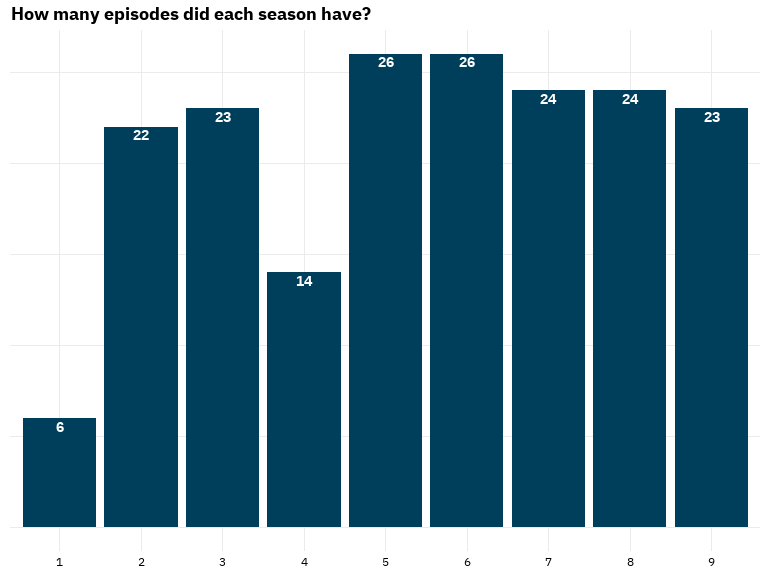
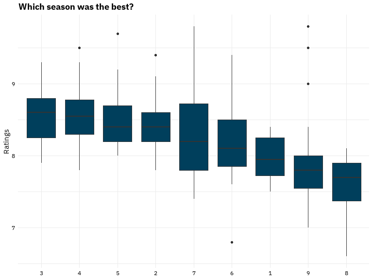
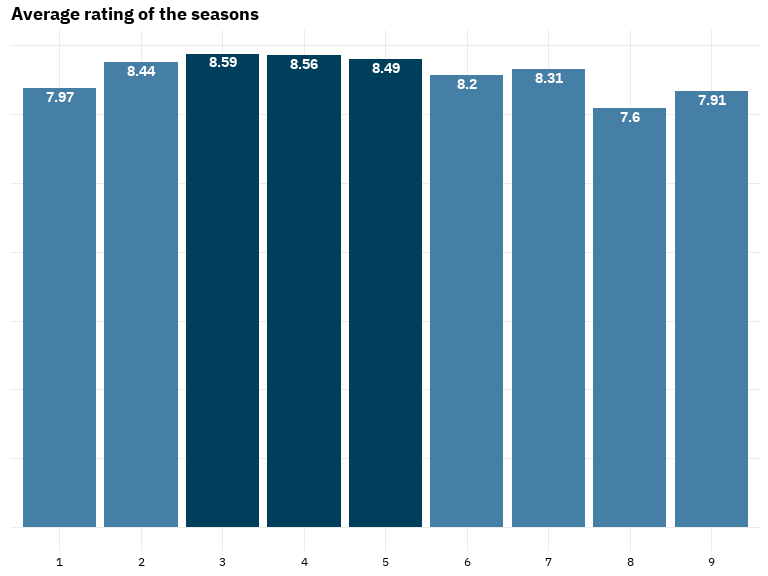
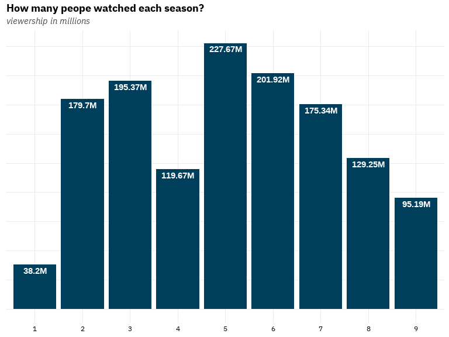
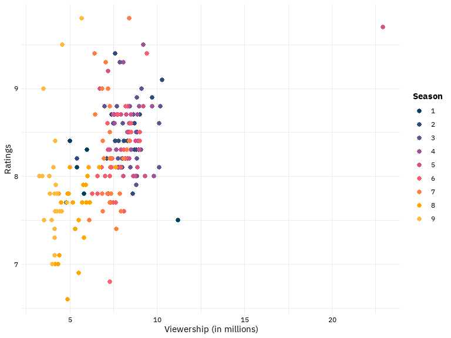
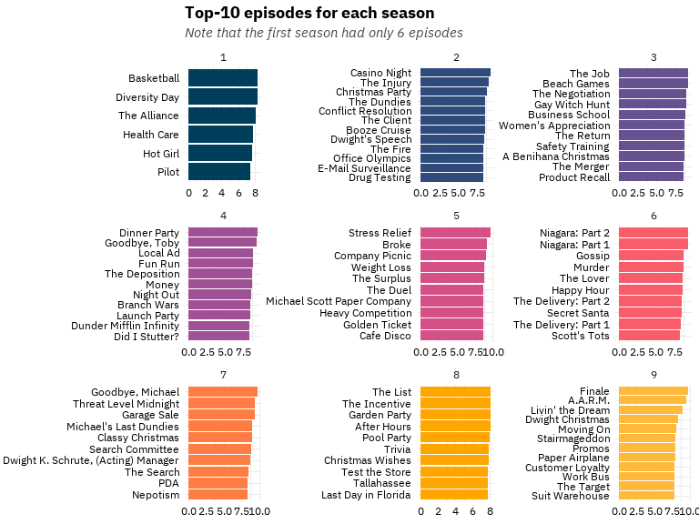
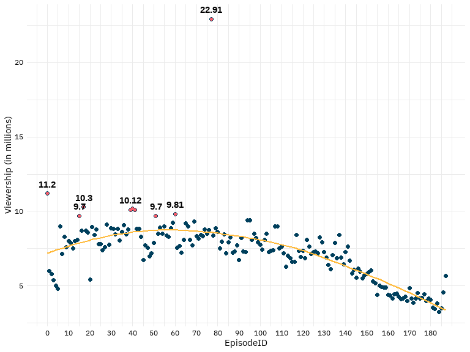
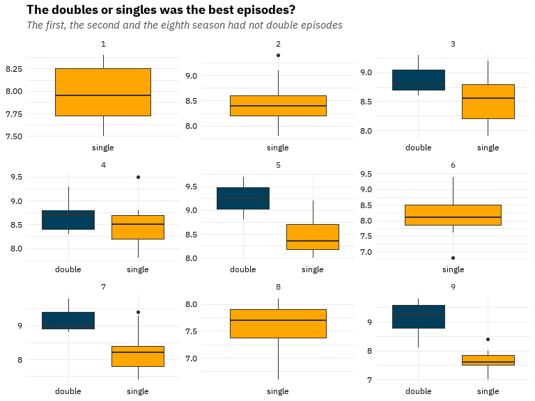
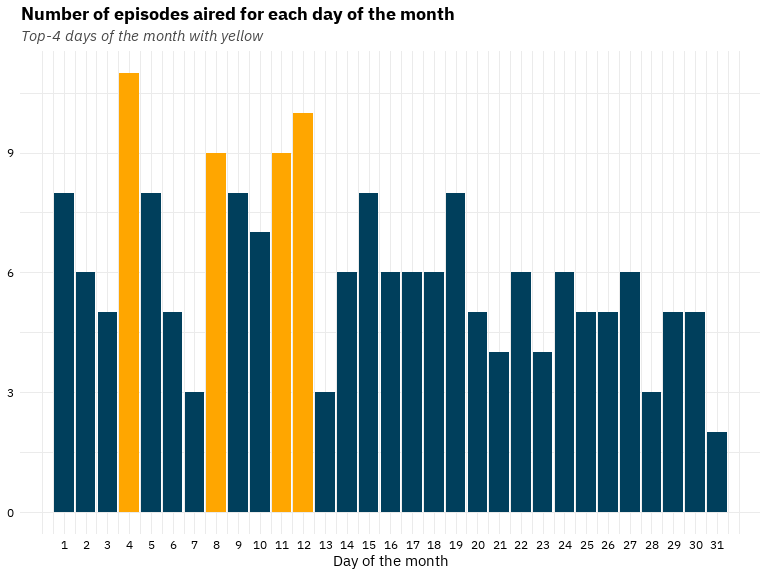
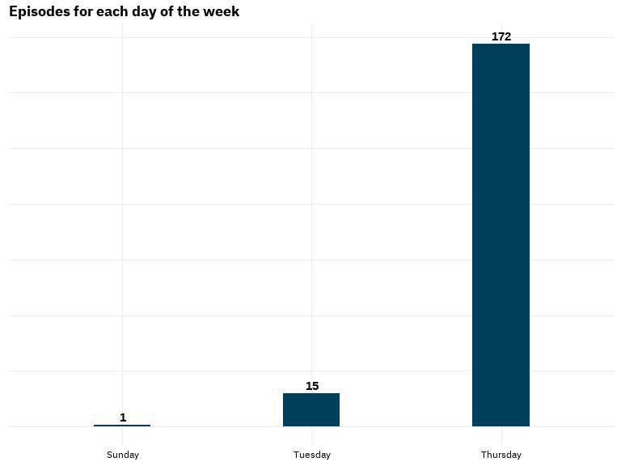

The Office episodes EDA
================

# Abstract

In the following analysis I will try to draw some interesting insights
for *The Office* series through descriptive analysis and text mining.
*The Office* is a
[mockumentary](https://en.wikipedia.org/wiki/Mockumentary) on a group of
typical office workers, where the workday consists of ego clashes,
inappropriate behavior, and tedium.

 

# Explore the Data

<!-- -->

<!-- -->

We can see the small difference between the top 3 in the bar graph
below.  
<!-- -->

<!-- -->

 

### **Ratings & Viwership**

-   Ratings range from 6.6 to 9.8 with an average of 8.24 and a median
    of 8.2.  
-   Viewership range from 3.25 to 23 millions with an average of 7.3
    millions and a median of 7.5 millions.

<!-- -->

    ##    Min. 1st Qu.  Median    Mean 3rd Qu.    Max. 
    ##   6.600   7.800   8.200   8.237   8.600   9.800

    ##    Min. 1st Qu.  Median    Mean 3rd Qu.    Max. 
    ##   3.250   5.990   7.535   7.246   8.425  22.910

As we can see in the graph below, the seasons with the highest ratings
and the biggest viewership were the first 6. We could also observe that
the more people watch the higher the rating was.  
<!-- -->

<!-- -->

<!-- -->

The increasing number of each episode has been recorded as EpisodeID. In
the diagram that follows we can observe that the larger the number of
episodes the less viewership it had. Look at the pink points are the top
8 EpisodeID by viewership. Seems like the most viewed episodes was the
early ones. The outlier point is the episode [*Stress
Relief*](https://www.imdb.com/title/tt1248736/) at season 5, with rating
9.7.  
<!-- -->

I categorized the episodes based on their duration into double or single
depending on whether the duration exceeds 30 minutes. Notice that the
double episodes have higher scores than the singles in every season.  
<!-- -->

There is not a strong pattern about the day of the month an episode was
released.  
<!-- -->

Contrariwise most episodes was released on Thursdays. That one episode
was the [*Stress Relief*](https://www.imdb.com/title/tt1248736/) episode
which had the highest rating and the biggest viewership averall.
<!-- -->

 

### **Who wrote the more episodes?**

    ## # A tibble: 14 x 3
    ##    `individual writer`     n   `%`
    ##    <chr>               <int> <dbl>
    ##  1 mindy kaling           22  9.78
    ##  2 paul lieberstein       16  7.11
    ##  3 b. j. novak            15  6.67
    ##  4 gene stupnitsky        15  6.67
    ##  5 lee eisenberg          15  6.67
    ##  6 greg daniels           13  5.78
    ##  7 brent forrester        11  4.89
    ##  8 jennifer celotta       11  4.89
    ##  9 justin spitzer         11  4.89
    ## 10 michael schur          10  4.44
    ## 11 charlie grandy          7  3.11
    ## 12 daniel chun             7  3.11
    ## 13 halsted sullivan        7  3.11
    ## 14 warren lieberstein      7  3.11

Check out some fan facts about the top-3 writers:  
1. [Mindy
Kaling](https://www.google.com/search?q=mindy+kaling&oq=mindy+kaling&aqs=chrome..69i57.719j0j7&sourceid=chrome&ie=UTF-8)  
2. [Paul
Lieberstein](https://www.google.com/search?q=paul+lieberstein&oq=paul+lieberstein&aqs=chrome..69i57.674j0j7&sourceid=chrome&ie=UTF-8)  
3. [B. J.
Novak](https://www.google.com/search?q=bj+novak&oq=bj+novak&aqs=chrome..69i57.2293j0j9&sourceid=chrome&ie=UTF-8)  
*Bonus*: Also,
[Mose](https://www.google.com/search?q=michael+schur&ei=2CcvYtWYEdqP9u8P7a-D8AQ&ved=0ahUKEwjV5O_NwMX2AhXah_0HHe3XAE4Q4dUDCA4&uact=5&oq=michael+schur&gs_lcp=Cgdnd3Mtd2l6EAMyBwgAEEcQsAMyBwgAEEcQsAMyBwgAELADEEMyDwguENQCEMgDELADEEMYATIMCC4QyAMQsAMQQxgBMgwILhDIAxCwAxBDGAEyDAguEMgDELADEEMYATIMCC4QyAMQsAMQQxgBMgwILhDIAxCwAxBDGAFKBAhBGABKBAhGGABQAFgAYLsWaANwAXgAgAEAiAEAkgEAmAEAyAEJwAEB2gEECAEYCA&sclient=gws-wiz)
wrote 10 episodes!!
